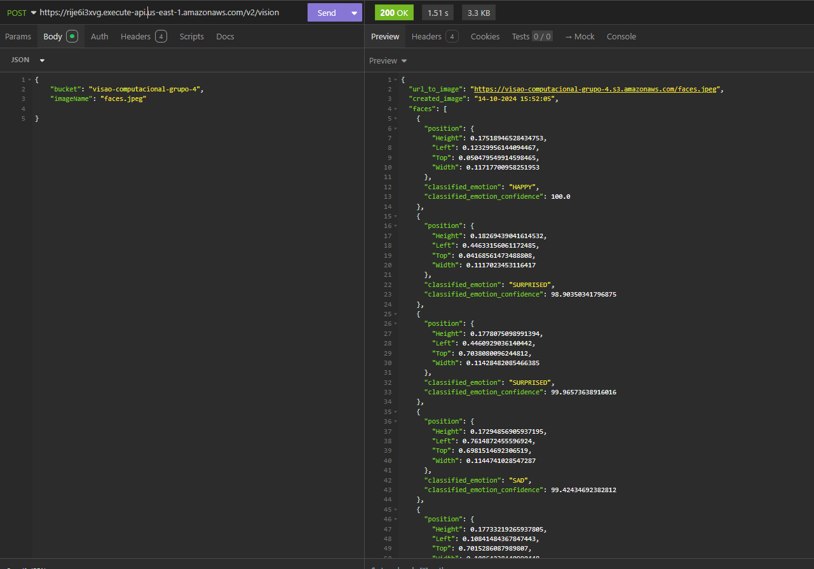
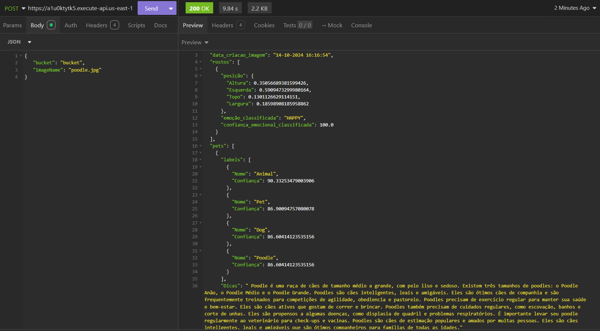

# 🖼️ Projeto: Análise de Imagens com Amazon Rekognition e Geração de Dicas com Amazon Bedrock 🐾

Este projeto implementa uma **API serverless** que utiliza serviços da AWS para **analisar imagens**, identificar **emoções em pessoas** e **detectar pets**. A API também gera dicas sobre **cuidados e comportamentos de pets** com base nas informações retornadas, utilizando o **Amazon Bedrock**.

## ✨ Funcionalidades

### 1. Análise de Emoções (Rota /v1/vision):
- Analisa imagens de rostos humanos e identifica as emoções predominantes.

### 2. Análise de Pets e Emoções (Rota /v2/vision):
- Detecta pets na imagem e, caso identifique um, gera dicas de cuidados para o pet usando o Amazon Bedrock. Também detecta e classifica emoções em rostos humanos presentes na imagem.

### 3. 📊 Integração com AWS CloudWatch:
- Todas as respostas das análises são registradas no CloudWatch para fins de monitoramento e auditoria.

### 4. 🗄️ Armazenamento de Imagens no S3:
- As imagens utilizadas para as análises são armazenadas no bucket do S3 e acessadas pela API.

## 🛠️ Tecnologias Utilizadas


**AWS Rekognition**: Para identificar emoções e objetos (pets) nas imagens.


**AWS Bedrock**: Para gerar dicas sobre cuidados e comportamento de pets, a partir do nome do animal identificado.


**AWS S3**: Armazenamento das imagens analisadas.


**AWS Lambda**: Para implementação da lógica serverless da API.


**AWS API Gateway**: Para expor as APIs publicamente.


**AWS CloudWatch**: Para registrar logs das análises realizadas.


**Serverless Framework**: Para gerenciar a infraestrutura e o deploy na AWS.


**Python**: Linguagem de programação utilizada para as funções Lambda.

Dessa maneira, a arquitetura que foi implantada em toda atividade, foi:

 

## 📂 Estrutura do Projeto

```bash
├── src/
│   ├── handler.py             # Lógica principal das funções Lambda
│   ├── rekognition_service.py # Funções para lidar com Amazon Rekognition
│   ├── bedrock_service.py     # Funções para lidar com Amazon Bedrock
│   └── utils.py               # Funções auxiliares
├── serverless.yml             # Configuração do Serverless Framework
├── README.md                  # Documentação do projeto
└── requirements.txt           # Dependências do projeto

```
- **handler.py**: Contém as funções Lambda, incluindo a v1_vision (detecção de emoções) e v2_vision (detecção de pets e emoções).
- **rekognition_service.py**: Funções para chamar o Amazon Rekognition e processar os resultados.
- **bedrock_service.py**: Funções para interagir com o Amazon Bedrock e gerar dicas baseadas nos resultados da análise.
- **serverless.yml**: Configura a infraestrutura AWS (Lambda, API Gateway, S3, CloudWatch) usando o Serverless Framework.
- **requirements.txt**: Lista de dependências Python necessárias para o projeto.

# 📸 Projeto Rekognition & Bedrock

Este projeto utiliza o Amazon Rekognition e o Amazon Bedrock para identificar emoções em humanos e pets, além de fornecer dicas de cuidados para pets. A API é desenvolvida com o Serverless Framework e se integra ao AWS.

## 🛠️ Pré-requisitos

Antes de começar, certifique-se de ter as seguintes ferramentas instaladas:

- **Node.js** (v12 ou superior) e **NPM**.
- **Python** (v3.8 ou superior).
- **Serverless Framework**: Para instalar o Serverless Framework, rode o comando:

    ```bash
    npm install -g serverless
    ```

- **AWS CLI** configurado com suas credenciais de acesso.

## 📥 Como Clonar o Repositório

Clone este repositório com o seguinte comando:

```bash
git clone https://github.com/usuario/projeto-rekognition-bedrock.git
```


```cd projeto-rekognition-bedrock```

## 📦 Instalação das Dependências

Instale as dependências do projeto Python listadas no arquivo requirements.txt:

```pip install -r requirements.txt```

## ☁️ Configurando o Bucket S3

Para o funcionamento correto do projeto, você precisará configurar um bucket no Amazon S3 para armazenar as imagens que serão analisadas.

- Crie um bucket S3 chamado, por exemplo, myphotos.
- Faça upload manual das imagens que deseja analisar para este bucket.

## 🚀 Como Usar na AWS

### 1. Configuração Inicial
O projeto está configurado para ser gerenciado com o Serverless Framework, facilitando o deploy na AWS. Certifique-se de que suas credenciais AWS estejam configuradas corretamente usando o comando:

    aws configure

### 2. Deploy
Para fazer o deploy da aplicação na AWS, execute o seguinte comando na raiz do projeto:

    serverless deploy

Isso irá provisionar todas as funções Lambda, API Gateway, e outros recursos necessários.

### 3. Rotas Disponíveis

### Rota 1: Análise de Emoções

#### Endpoint: POST /v1/vision

Parâmetros:

    {
        "bucket": "myphotos",
        "imageName": "person.jpg"
    }

Resposta:

    {
        "url_to_image": "https://myphotos.s3.amazonaws.com/person.jpg",
        "created_image": "02-10-2024 14:30:00",
        "faces": [
            {
            "position": {
                "Height": 0.0633,
                "Left": 0.1718,
                "Top": 0.7366,
                "Width": 0.1106
            },
            "classified_emotion": "HAPPY",
            "classified_emotion_confidence": 99.93
            }
        ]
    }

### Rota 2: Análise de Pets e Emoções

#### Endpoint: POST /v2/vision

Parâmetros:

    {
        "bucket": "myphotos",
        "imageName": "labrador.jpg"
    }
Resposta (Apenas pets):

    {
        "url_to_image": "https://myphotos.s3.amazonaws.com/labrador.jpg",
        "created_image": "02-10-2024 14:30:00",
        "pets": [
            {
            "labels": [
                { "Confidence": 96.59, "Name": "Animal" },
                { "Confidence": 96.59, "Name": "Dog" },
                { "Confidence": 96.59, "Name": "Labrador" }
            ],
            "Dicas": "Dicas sobre Labradores: Nível de Energia: Médio, ... Cuidados: Penteie semanalmente, ..."
            }
        ]
    }
Resposta (Pets e Pessoas):

    {
        "url_to_image": "https://myphotos.s3.amazonaws.com/labrador_and_person.jpg",
        "created_image": "02-10-2024 14:30:00",
        "faces": [
            {
            "position": {
                "Height": 0.0633,
                "Left": 0.1718,
                "Top": 0.7366,
                "Width": 0.1106
            },
            "classified_emotion": "HAPPY",
            "classified_emotion_confidence": 99.93
            }
        ],
        "pets": [
            {
            "labels": [
                { "Confidence": 96.59, "Name": "Animal" },
                { "Confidence": 96.59, "Name": "Dog" },
                { "Confidence": 96.59, "Name": "Labrador" }
            ],
            "Dicas": "Dicas sobre Labradores: Nível de Energia: Médio, ... Cuidados: Penteie semanalmente, ..."
            }
        ]
    }

## Exemplo de Análise de Emoções

### Resultado 1: Análise de Emoções


### Resultado 2: Análise de Emoções


## Exemplo de Análise de Pets

### Resultado 1: Análise de Pets


### Resultado 2: Dicas de Cuidados para Pets


## ⚠️ Dificuldades Encontradas

- Tratar a resposta gerada pelo Bedrock


## 👨‍💻 Autores
- <a href="https://github.com/fredMelchior">Fred Melchior<a/>
- <a href="https://github.com/Macedorael">Israel Macedo<a/>
- <a href="https://github.com/ResendeLiz">Lizandra Resende<a/>
- <a href="https://github.com/alexanderjr02">Alexander Nascimento<a/>
