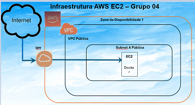
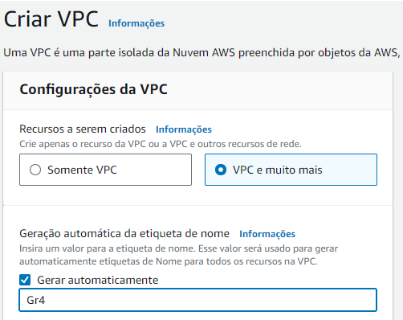
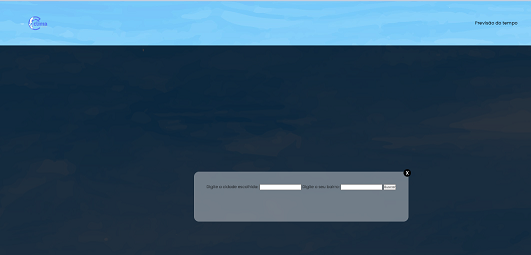
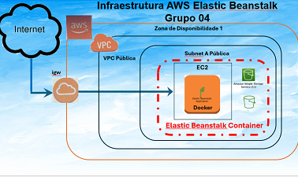
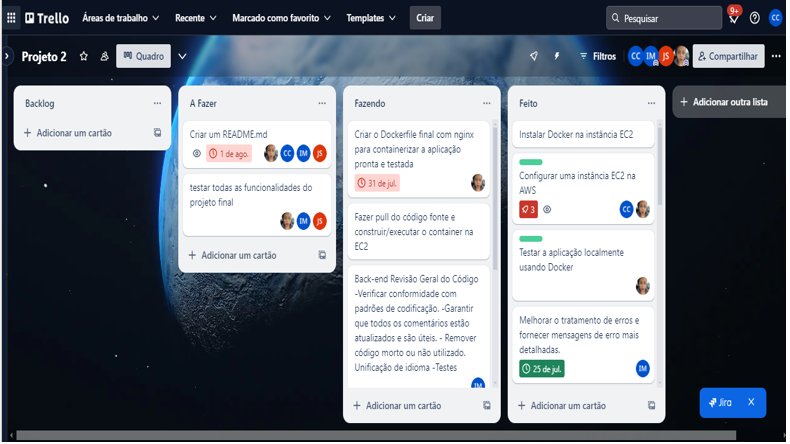

  
# Programa de Bolsas Junho/2024

# Grupo4 - Sprint 2/3

## Índice
1. [Projeto CLIMA Cast](#titulo)
2. [Versão](#versao)
3. [Do Licenciamento](#licenciamento)
4. [Dos Requisitos para Instalação](#instalacao)
5. [Do Aplicativo](#doaplicativo)  
    5.1. [Estrutura do Projeto](#projeto)  
    5.2. [Obtendo o Código da Aplicação](#codigo)  
    5.3. [Obtenha uma API *key* da Open Weather Map](#apikey)  
    5.4. [Sobre o **Front-End**](#front-end)  
    5.5. [Sobre o **Back-End**](#back-end)  
    * [Instalar as Dependências](#dependencias)
        
    5.6. [Sobre o Ambiente na Nuvem](#nuvem)  
    * [Utilização de uma instância EC2](#EC2)  
        * [Instalação Passo a Passo](#passoapassoEC2)
        
            * [Gerando e Testando o *Container* do Docker](#geraDockerEC2)
            * [Configurando a API de Previsão do Tempo](#APIEC2)
            * [Criando a VPC, SubNets, Routes e Internet Gateway](#VPCEC2)
            * [Criando a Instância EC2](#instanciaEC2)
            * [`Carregando` o *Container* Docker na Instância EC2](#containerEC2)
            * [Conectar-se à Instância EC2](#conectarEC2)

    * [Utilização do Ambiente Beanstalk](#Beanstalk)
        * [Instalação Passo a Passo](#passoapassoBeanstalk) 
        
            * [Preparar arquivos do Docker](#dockerBeanstalk)
            * [Criando o Ambiente Beanstalk](#criaBeanstalk)
            * [Erros Comuns](#erros)
            * [Conectar-se ao Ambiente Beanstalk](#conectarBeanstalk)

6. [Dificuldades/Pontos Fracos](#fraquezas)
7. [Pontos Fortes](#forcas)
8. [Oprotunidades de Melhoria](#melhorias)
9. [Manual de Uso da Aplicação *Clima Cast*](#aplicacao)
10. [Autores](#autores)

## Projeto *CLIMA Cast*

Este projeto consiste no desenvolvimento e disponibilização de uma **Aplicação Web** que permite consultar a `Previsão do Tempo` para uma  `Cidade` e `Bairro` utilizando uma chamada à  **API da Open Weather Map**.

A previsão do tempo é **fundamental** porque influencia diretamente sobre diversas atividades humanas e na tomada de decisões.

Saber com antecedência como estará o clima permite que  as pessoas e as empresas se preparem adequadamente, seja para planejar viagens, escolher roupas adequadas, realizar cultivos agrícolas, ou até mesmo para se proteger de eventos climáticos adversos.

Além disso, a previsão meteorológica auxilia na gestão de recursos naturais e na mitigação de desastres, fornecendo informações cruciais para a segurança pública e o bem-estar coletivo.

Este aplicativo foi estruturado na forma de um *Front-End*, que recebe as solicitações dos usuários; e um *Back-End* que consome a API de previsão do tempo da *Open Weather Map*, afim de obter as informações de previsões climáticas.

Este aplicativo foi desenvolvido utilizando as ferramentas  **Javascript-Node.js, Express, Axios e Docker**, sendo hospedado em um ambiente de **Nuvem AWS**.

## Versão

Atualmente está disponível a **Versão 1.0** do `Aplicativo`, disponibilizada em Agosto/2024.

## Do Licenciamento

Esta aplicação está licenciada para uso como `Software Livre` podendo ser baixada, utilizada e testada, amplamente por todo e qualquer usuário interessado.

## Dos Requisitos para Instalação

Para a instalação e execução desta **Aplicação** será necessário observar os seguites requisitos:

* Dispor de um Computador com **Windows** ou **Linux** instalados;
* Instalar o <a href="https://nodejs.org/pt" target="_blank">Node.js</a>; 
* Cadastrar uma Conta na <a href="https://openweathermap.org/api/hourly-forecast" target="_blank">Open Weather Map"</a> para obter uma `API key`;
* Instalar o <a href="https://www.docker.com/products/docker-desktop/" target="_blank">Docker</a>;
* Cadastrar uma Conta na <a href="https://signin.aws.amazon.com/signin?redirect_uri=https%3A%2F%2Fconsole.aws.amazon.com%2Fconsole%2Fhome%3FhashArgs%3D%2523%26isauthcode%3Dtrue%26nc2%3Dh_ct%26oauthStart%3D1721853265030%26src%3Dheader-signin%26state%3DhashArgsFromTB_us-east-2_587fc644fa15add5&client_id=arn%3Aaws%3Asignin%3A%3A%3Aconsole%2Fcanvas&forceMobileApp=0&code_challenge=WXvJVPZ8DJQhZD4BDyT_luZie3H8aTgbwBAXL4R0ycA&code_challenge_method=SHA-256" target="_blank">AWS</a>;
* Implantar a Infraestrutura AWS recomendada.

## Do Aplicativo

Nesta seção serão abordados aspectos referentes à disponibilização do Aplicativo e estruturação do *Softtware*.

## Estrutura do Projeto

        src/
        │
        └── public/
        │   └── assets/
        │       └── docs/
        │       │   └── G4 EC2 - Calculadora de Preços da AWS.pdf
        │       │   └── G4 EC2 - Calculadora de Preços da AWS.pdf
        │       │   └── Passo a passo para utilização da aplicação Clima Cast.pdf
        │       │
        │       └── images/
        │       │   └── autonomia.png
        │       │   └── AWS.png
        │       │   └── bannerlogo.bmp
        │       │   └── clima.png
        │       │   └── compartilhar.png
        │       │   └── comunicar.png
        │       │   └── consoleAMIEC2.png
        │       │   └── ConsoleEC2.png
        │       │   └── descomplicado.png
        │       │   └── EC2.png
        │       │   └── ElasticBeanstalk.png
        │       │   └── foco.png
        │       │   └── FundoCeu.jpg
        │       │   └── iamec2.png
        │       │   └── persistencia.png
        │       │   └── pessoas.png
        │       │   └── senso.png
        │       │   └── tela.png
        │       │   └── TRELLO.png
        │       │   └── VPC_1.png
        │       │        
        │       └── css/
        │       │   └── style.css
        │       │
        │       └── js/
        │           └── modal.js
        │
        └── routes/
        │   └── previsao.js
        │
        └── views/
        │   └── index.hbs
        │
        └── Dockerfile
        │
        └── Dockerfile.nginx
        │
        └── docker-compose.yml
        │
        └── nginx.conf
        │
        └── server.js
        │
        .gitignore
        │
        README.md

## Obtendo o Código da Aplicação

Para efetuar o *download* do código acessar o <a href="https://github.com/Compass-pb-aws-2024-JUNHO/sprints-2-3-pb-aws-junho/tree/Grupo-4/src" target="_blank">github</a> e efetuar um *git clone* do projeto.

## Obtenha uma API *key* da **Open Weather Map**

Acesse o site da <a href="https://openweathermap.org/api/hourly-forecast" target="_blank">Open Weather Map</a> e crie uma conta.

Gere uma chave de acesso (*access key*).

*Configure a sua `Chave de acesso`:*

* Abra o arquivo **server.js** na raiz do projeto.

* Substitua 'YOUR_ACCESS_KEY' pela sua chave de acesso da Open Weather Map.

* Inicie o servidor:  
    *node server.js*

## Sobre o Front-end

O **Front-end** é a parte do aplicativo que está muito relacionado com a interface gráfica do projeto; ou seja, é a parte do código que interage diretamente com o usuário, seja em softwares, sites, aplicativos, etc.

É responsável pela parte visual como apresentação, design, linguagens, cores, entre outros.

É essencial nesta codificação que se tenha uma preocupação maior com a experiência do usuário.

## Sobre o Back-end

O **Back-end** é a estrutura que possibilita a operação do sistema, propriamente dita, recebendo as solicitações enviadas pelo **Front-end** e realiza as ações solicitadas por parte dos usuários.

A função de um **Back-end** está relacionada com servidores, bancos de dados, segurança, estrutura, gerenciamento de conteúdo e atualizações.

Esse tipo de código se aplica para tratar os dados e também é responsável pelas inserções, arquivamentos e leituras de dados, por trás de uma aplicação.

De forma resumida, são recursos que garantem a concretização dos processos em um ambiente eletrônico, como buscas em um *site* de compras ou até mesmo ações mais complexas.

## Instalar as Dependências

1. Executar os seguintes comandos:  
    *npm install*  
    *npm start*
    
2. Acesse a aplicação no navegador:  
    Abra o navegador e acesse o site *http://localhost:3000/*

3. Funcionalidades:  
    **Informe o Nome da Cidade:** Digite o nome da **cidade**.  
    **Informe o Nome do Bairro:** Digite o nome do **bairro**. 
    
    **OBSERVAÇÃO IMPORTANTE:** Os nomes da Cidade e do Bairro são **obrigatórios** para a Consulta. Esta opção foi adotada afim de permitir maior precisão na obtenção das informações.

    **Consulta do Clima:** Clique no **botão** para buscar a previsão do tempo.
    
    **Modal de Resultados:** Os dados da previsão do tempo são exibidos em um modal.
    
4. Validação de Entradas:  
    Os campos de entrada informados são verificados para garantir que não estão com o conteúdo *vazio*.  
    
5. Tecnologias Utilizadas:  
    *Node.js*  
    *Express*  
    *Axios*  
    *HTML, CSS e JavaScript*

6. Tratamento de Erros da API:  
    Mensagens de erro **detalhadas** serão exibidas caso ocorra algum *tipo* de erro na consulta à **API**.

## Sobre o Ambiente na Nuvem

Este Aplicativo foi concebido com o intuito de ser executado em um ambiente na `Nuvem`.

De uma forma simples a computação na `Nuvem`, é uma tecnologia que permite acesso remoto a softwares, armazenamento de arquivos e processamento de dados por meio da internet. É uma alternativa para você acessar dados importantes de qualquer computador, em qualquer lugar.

No presente projeto foi adotada a Nuvem da *AWS - Amazon Web Services* . 

Para usuários corporativos se recomenda a utilização da ferramenta <a href="https://us-east-1.console.aws.amazon.com/wellarchitected/home?region=us-east-1#/workloads" target="_blank">AWS Well-Architected Tool</a> que efetua uma pré-avaliação do seu ambiente, apontando oportunidades de melhoria. Importante ressaltar a necessidade da escolha correta da *Região* aonde se pretende instalar a infraestrutura, no `link`disponibilizado se está trabalhando com o *Norte da Virgínia*.

Este <a href="https://github.com/Compass-pb-aws-2024-JUNHO/sprints-2-3-pb-aws-junho/tree/Grupo-4/src/public/assets/docs/G4AWSInfraestructure_wellarchitected.pdf" target="_blank">Relatório</a> representa um exemplo da utilização desta ferramenta.

Outro ponta a ser considerado é a possibilidade de se obter uma estimativa de custos da infraestrutura selecionada utilizando-se a <a href="https://calculator.aws/#/" target="_blank">Calculadora de Custos</a>. Um exemplo de estimativa obtido por meio desta calculadora se encontra em <a href="https://github.com/Compass-pb-aws-2024-JUNHO/sprints-2-3-pb-aws-junho/tree/Grupo-4/src/public/assets/docs/G4 EC2 - Calculadora de Preços da AWS.pdf" target="_blank">Estimativa de Custos</a>. Também neste caso é importante atentar para a *Região* uma vez que os Custos variam de *Região* para *Região*.

No desnvolvimento deste projeto foram aplicadas duas soluções na `Nuvem` da **AWS - Amazon Web Services**:
* Utilização de uma instância EC2;
* Utilização do Ambiente Beanstalk.

## Utilização de uma instância EC2

 Esta primeira solução, mais simples, utiliza uma *instância* **EC2** e funciona bem, porém, pode apresentar *desafios de segurança* e *continuidade operacional*.
 
 A aplicação pode residir em *repositórios privados* no Docker Hub, para melhorar a seguramça do código, no entanto, a solução carece de **opções** de disponibilidade, em caso de `queda`da instância EC2; neste caso, a aplicação ficará `fora do ar`, exigindo atuação externa para sua recuperação. A figura abaixo apresenta um esquemático desta implantação.

 

O `container`do **Docker** é carregado em uma instância **EC2** que é executada em uma *SubRede Pública* residente em uma *VPC Pública* recebendo e respondendo às solicitações através de um *Internet Gateway (igw)*.

## Instalação Passo a Passo

## Gerando e Testando o *Container* do Docker

1. Faça o Login no Docker Hub:

    *docker login*

2. Baixe a *imagem* mais recente do Docker Hub ou Construa a imagem Docker:

    *docker pull monizaoliveira/climacast:latest*
    ou
    *docker build -t ClimaCast*

3. Execute o *Container*:

    *docker run -p 3000:3000 monizaoliveira/climacast:latest*

3. Acesse a aplicação em seu navegador (**para testar localmente**):

    *[http://localhost:3000](http://localhost:3000)*

## Configurando a API de Previsão do Tempo

1. Para configurar a API, substitua a variável `apiKey` em ` src/routes/previsao.js` com a sua chave da API.

## Criando a VPC, SubNets, Routes e Internet Gateway

1. Na console da AWS acesse o serviço **VPC**.
2. Para agilizar e facilitar a criação, marque a opção *VPC e muito mais* e informe o *prefixo* desejado; isto agiliza o processo e evita erros.

 

3. Informe a quantidade de *Subnets Públicas e Privadas* e tecle em *Criar VPC*.

## Criando a Instância EC2

1. Acesse a console da AWS e vá para o serviço **EC2**.
2. Clique em "Criar Instância".
3. Escolha uma AMI (Amazon Machine Image). Para este projeto, utilize a **"Amazon Linux 2 AMI (HVM), SSD Volume Type"**.
4. Escolha o tipo de instância. Uma `t2.micro` é suficiente.
5. Preencha as configurações da instância conforme necessário.
6. Adicione o armazenamento **EBS** (pode-se manter o valor padrão).
7. Adicione as tags (opcional).
8. Configure o grupo de segurança:
* Regras de Entrada (*INBOUND*)
   - Adicione uma regra para permitir o tráfego HTTP na porta 80;
   - Adicione uma regra para permitir o tráfego HTTPS na porta 443;
   - Adicione uma regra para permitir o tráfego SSH na porta 22 (para acesso ao servidor a partir do seu *IP*);
   - Adicione uma regra para permitir o tráfego SSH na porta 22 a partir do *IP* 18.206.107.24/29 (para acesso ao servidor pela console EC2 da AWS).
   
* Regras de Saída (*OUTBOUND*)
    - manter o valor padrão.
9. Revise e pressione o Botão para **Criar a Instância**.
10. Crie um novo par de chaves ou use um existente para acessar a instância via SSH.
11. Acesse a sua instância utilizando a console do EC2 (ver figuras abaixo) e execute a Carga do Container, conforme descrito a seguir.

 

##  `Carregando` o *Container* Docker na Instância EC2

1. Execute os seguintes comandos para instalar e carregar o Docker:  
    *sudo yum update -y*  
    *sudo amazon-linux-extras install docker* `(AMI Amazon Linux 2)`  
    *sudo service docker start*
    *sudo usermod -a -G docker ec2-user*

2. Fazer Login no Docker Hub (Opcional)

   Se você criou a imagem Docker localmente e a enviou para o Docker Hub, faça login:  
    *docker login*

3. Baixar o Contêiner Docker do Docker Hub para a Instância EC2  
    Puxe a imagem Docker do Docker Hub (substitua seu-usuario e
ClimaCast pelo nome do seu repositório e imagem):  
    *docker pull seu-usuario/ClimaCast*

4. Execute o contêiner Docker  
    *docker run -d -p 80:3000 seu-usuario/ClimaCast*

## Conectar-se à Instância EC2

1. Conecte-se à sua instância executando no EC2  
    *http://ec2-3-87-193-140.compute-1.amazonaws.com*  
    
    Após clicar no *link* será exibida a tela da aplicação, ilustrada a seguir:  
    

   

## Utilização do Ambiente Beanstalk

 Esta solução apresenta um *maior grau de dificuldade*, e consiste na criação de um **ambiente Beanstalk**, automaticamente gerenciado pela **AWS**. Com isto, fica garantida uma **maior** segurança, uma vez que a aplicação passa a residir no ambiente *interno* da AWS, que é um ambiente de acesso **controlado**; e, fica garantida a **total** *continuidade* operacional, visto que o Ambiente *Beanstalk* executa *automaticmente* a recuperação em caso de falhas na instância **EC2**, sem a necessidade de qualquer intervenção **externa**.
 
 Outro fato a destacar é que facilita em muito toda e qualquer manutenção na aplicação, seja ela evolutiva ou não, uma vez que a imagem fica armazenada em um arquivo **.zip** residente em um *bucket* **S3** criado e gerenciado pelo ambiente **Beanstalk**.
 
 A figura abaixo apresenta um esquemático desta implantação.

## Instalação Passo a Passo

## Preparar arquivos do Docker

1. Dockerfile  
    Define o ambiente para executar a aplicação **Node.js**. Atentar para os seguintes passos: 
      
      * Escolher a imagem base com **Node.js**;  
      * Configurar o diretório de trabalho;  
      * Instalar dependências;
      * Copiar arquivos da aplicação;
      * Expôr a porta para a aplicação.

2. Dockerfile.nginx  
    Configurar o Nginx para servir à aplicação Node.js e fornecer funcionalidades de *proxy* reverso. Inclui a definição da imagem base do Nginx e a cópia do arquivo de configuração do Nginx.

3. nginx.conf  
    **Arquivo de configuração do Nginx** que define o *proxy* reverso para a aplicação Node.js. Ele configura o Nginx para redirecionar requisições HTTP para o container Node.js.

4. docker-compose.yml  
    Este arquivo é usado para definir e gerenciar múltiplos containers Docker. Ele configura o container da aplicação Node.js e o container *Nginx*, além de definir como eles se comunicam.

5. Criação do arquivo **.zip** a ser carregado no Ambiente AWS Elastic Beanstalk  
    Preparação do Pacote de *Deploy* 
    * Compacte os arquivos necessários, incluindo o Dockerfile, Dockerfile.nginx, nginx.config, e qualquer outro arquivo relevante;  
    * Compacte os arquivos necessários usando o Windows Explorer: selecione a pasta do projeto, Clique com o botão direito na pasta e escolha "*Enviar para*" > "Pasta compactada (zipada)";  
    * Nomeie o arquivo ZIP conforme desejado, por exemplo, *app.zip*.

## Criando o Ambiente Beanstalk

1. Utilizando o IAM defina as permissões 
    * Para o serviço Beanstalk utilizar os padrões apresentados;
    * Para o serviço EC2 utilizar as ilustradas abaixo.  
    

   

2. Criar a VPC, idêntico ao descrito para o EC2
3. Criar o Secutity Group, também idêntico ao EC2
4. Criar o Ambiente Beanstalk
5. Por fim efetuar o *Deploy* do arquivo **.zip** gerado anteriormente  
    * Acesse o Console do AWS Elastic Beanstalk;
    * Selecione a aplicação desejada;
    * Clique no botão "*Upload and Deploy*" no painel do Elastic Beanstalk;
    * Selecione o arquivo ZIP criado e faça o upload;
    * O Elastic Beanstalk irá processar o arquivo ZIP e realizar o deploy automaticamente.

## Erros Comuns

1. Arquivos de configuração ausentes: Certifique-se de que todos os arquivos necessários estão incluídos no pacote de deploy.  
2. Imagem Docker não encontrada: Verifique se as imagens foram corretamente enviadas para o Docker Hub.

## Conectar-se ao Ambiente Beanstalk

1. Conecte-se à aplicação executando no Ambiente Beanstalk  
    *http://climacast.us-east-1.elasticbeanstalk.com/*  
    Após clicar no *link* será exibida a tela da aplicação, ilustrada a seguir:  
    

   

**OBSERVAÇÃO IMPORTANTE:** Devido ao Custo mais elevado da solução *Beanstalk*, ela se encontra **desabilitada** e ficará disponível em ocasião próxima ao *agendamento* da apresentação por parte do Grupo.

## Dificuldades/Pontos Fracos

No desenvolvimento deste **projeto** foram observadas algumas dificuldades relatadas nos itens a seguir:
* No *Front-End* foi utilizado um `modal` e se observou uma dificuldade entre o `modal` e a funçao utilizada no *botão de Busca*. Após ajustes e tentativas o problema foi resolvido com sucesso;
* No *Back-end* a documentação da **API** estava bem detalhada, o que ajudou muito no desenvolvimento, se observando uma relativa dificuldade com relação à formatação da *data* retornada e também com a necessidade de se limitar o número de linhas retornadas;
* Sem sombras de dúvidas, a configuração da *infraestrutura da Nuvem AWS* foi a que consumiu maior dedicação, principalmente, com relação à aplicação do **serviço** *Beanstalk*.

## Pontos Fortes

A experiência da equipe foi muito boa e por isso temos muitos pontos a destacar:
* Primeiro com relação à organização dos trabalhos foi utilizada a ferramenta de *métodos ágeis* denominada **Trello**. Abaixo esta exibida uma imagem extraída do **Trello**;  

*   **Liderança Compartilhada** foi uma marca observada na equipe. Não houve a imposição de um `Líder`; conforme a situação exigia, ocorria o surgimento de uma liderança natural com habilidades para conduzir os trabalhos e superar as dificuldades que se apresentavam. Outro quesito crucial com relação às pessoas se trata do alto grau de **empatia** observado, não se relatando nenhuma desavença, discussão acalorada e discórdia no seio da equipe;

*   Cada membro da equipe foi cioso e consciente do que o seu trabalho representava para os resultados do projeto;

*   Todo e qualquer problema e/ou dificuldade era abraçado pela equipe em um esforço conjunto para sua solução;

*   O compartilhamento do conhecimento foi a tônica da equipe, inclusive estendendo este compartilhamento aos demais grupos conforme solicitação;

*   A comunicação durante o projeto foi farta, clara e objetiva. Através da *ferramenta* **Trello**, utilizando reuniões *online* e mesmo através de `Grupo de WhatsApp` a equipe manteve alto grau de comunicação, permitindo transparência de todas as atividades desenvolvidas e mantendo a equipe no mesmo nível de evolução do projeto;

*   O foco na disponibilização de uma ferramenta prática, operacional e funcional foi importqante para evoluir na busca de uma aplicação segura e contínua;

*   Em nenhum momento a equipe se descuidou com relação ao prazo estabelecido, sem contudo, pular etapas e/ou mesmo se utilizar de artifícios pouco técnicos para a solução das dificuldades apresentadas;

*   Por fim, e não menos importante, a simplicidade sem perder a qualidade se tornou uma bandeira da equipe, em prol de uma solução eficiente, com custos controlados, factível de ser implementada, fácil para o usuário final e útil para todos.

## Oportunidades de Melhoria

A equipe desenvolvedora acredita que oportunidades de melhorias sempre existirão, no entanto, no presente processo, ficou demonstrado que a equipe buscou formas de evoluir a solução, seja pelo aspecto da segurança, seja sob o aspecto da continuidade operacional. Toda e qualquer sugestão poderá ser encaminhada para os membros da equipe que desde já agradecem.

## Manual de Uso da Aplicação *Clima Cast*

<a href="https://github.com/Compass-pb-aws-2024-JUNHO/sprints-2-3-pb-aws-junho/tree/Grupo-4/src/public/assets/docs/Passo a passo para utilização da aplicação Clima Cast.pdf" target="_blank">Manual de Uso do Clima Cast</a>

## Autor(es)

<a href="https://www.linkedin.com/in/moniza-pelegrini-9936a1217/" target="_blank">Moniza de Oliveira Silva S. Pelegrini</a> 
<a href="https://www.linkedin.com/in/john-sousa-28072212ti/" target="_blank">John Lennon Cavalcante de Sousa</a> 
<a href="https://www.linkedin.com/in/israel-macedo-da-silva-026969245/" target="_blank">Israel Macedo da Silva</a> 
<a href="https://www.linkedin.com/in/carlos-catao-88b0b3321/" target="_blank">Carlos Altomare Catao</a>

