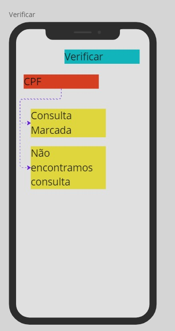

# NutriBot
## Agendamento com AWS Lex e Polly

## Índice

1. [Descrição](#descrição)
2. [Arquitetura](#arquitetura)
   - [Parte 1 - Integração com Polly](#parte-1---integração-com-polly)
   - [Parte 2 - Integração com Lex](#parte-2---integração-com-lex)
3. [Componentes da Arquitetura](#componentes-da-arquitetura)
4. [Tecnologias Utilizadas](#tecnologias-utilizadas)
5. [Estrutura de Pastas](#estrutura-de-pastas)
6. [Preview do Bot integrado com Slack](#preview-do-bot-integrado-com-slack)
7. [Pré-requisitos](#pré-requisitos)
8. [Configuração](#configuração)
   - [Criar serviços na AWS](#1-criar-serviços-na-aws)
   - [Implementar as funções Lambda](#2-implementar-as-funções-lambda)
   - [Integração](#3-integração)
9. [Como Executar](#como-executar)
10. [Dificuldades enfrentadas](#dificuldades-enfrentadas)
11. [Autores](#autores)

## Descrição

Este projeto consiste na implementação de um chatbot que utiliza os serviços AWS Lex e Polly, integrados por funções Lambda, para fornecer interações de voz em tempo real através de um canal de chat. A arquitetura aproveita diversas soluções da AWS, como API Gateway, DynamoDB, e S3, para criar uma experiência completa de conversação com conversão de texto para fala e gerenciamento de dados de áudio.

## Arquitetura

O fluxo principal do projeto é o seguinte:

1. **Chat**: O ator inicia uma interação via um canal de chat.
2. **Parte 1 - Integração com Polly**:
   - O chatbot envia uma mensagem de texto via API Gateway para uma função Lambda (`Integrador Polly`), que converte a mensagem em áudio usando o **Amazon Polly**.
   - O áudio gerado é armazenado no **Amazon S3** e informações relacionadas são registradas no **Amazon DynamoDB**.
3. **Parte 2 - Integração com Lex**:
   - Paralelamente, a função Lambda (`Backend Lex`) se comunica com o **Amazon Lex** para processar a mensagem de texto e gerar uma resposta adequada.
   - O áudio gerado pela função Lambda é enviado ao canal de chat para o usuário.

### Componentes da Arquitetura

- **API Gateway**: Exposição do endpoint para comunicação externa.
- **Lambda (Integrador Polly)**: Função responsável por orquestrar a integração com o Polly para gerar o áudio.
- **Polly**: Serviço de conversão de texto para áudio.
- **DynamoDB**: Banco de dados para armazenar metadados e logs de interações.
- **S3**: Armazenamento dos arquivos de áudio gerados.
- **Lambda (Backend Lex)**: Função responsável pela integração com o Lex e gerenciamento de respostas do chatbot.
- **Lex**: Serviço que fornece o backend de conversação.

## Tecnologias Utilizadas

-  **AWS API Gateway**: Para expor o endpoint de comunicação.
-  **AWS Lambda**: Para funções de backend.
-  **Amazon Polly**: Para conversão de texto para fala.
-  **Amazon Lex**: Para o processamento de linguagem natural.
-  **Amazon S3**: Para armazenamento de arquivos de áudio.
-  **Amazon DynamoDB**: Para armazenamento de logs e metadados.
-  **Python**: Linguagem de programação utilizada para as funções Lambda.

## Fluxo do ChatBot

    

        
        
        
    

    

        
        
        
        
    

## Estrutura de pastas

- api-tts/
    - ├── .env                  
    ├── .gitignore            
    ├── handler.py            
    ├── package-lock.json      
    ├── package.json          
    ├── README.md             
    ├── requirements.txt      
    └── serverless.yml        

- assets/

- lexbot/

    - └── lambda/ 
        - ├── __init__.py       
        ├── agendar.py        
        ├── cancelar.py       
        ├── lambda_function.py
        ├── regex.py          
        ├── saudacoes.py      
        ├── utils.py          
        └── verificar.py      

    - versoes-bot/
        - ├── botteste/             
        ├── nutribotv1/           
        ├── nutribotv2/           
        └── NutriBotFinal.zip     

- api-tts/: Diretório principal contendo o código relacionado à API de Text-to-Speech, com configurações do Serverless Framework e pacotes npm.
    - .env: Variáveis de ambiente.
    - .gitignore: Arquivos a serem ignorados no controle de versão.
    - handler.py: Arquivo principal de execução para o Lambda.
    - package-lock.json e package.json: Gerenciamento de dependências.
    - requirements.txt: Dependências do Python.
    - serverless.yml: Configurações para o framework Serverless.
- assets/: Arquivos de mídia ou outros recursos estáticos.
- lexbot/: Código relacionado ao Lex Bot, organizados na pasta lambda/.
    - __init__.py: Inicializa o módulo.
    - agendar.py: Lógica de agendamento.
    - cancelar.py: Função de cancelamento.
    - lambda_function.py: Ponto de entrada no AWS Lambda.
    - regex.py: Expressões regulares para validação.
    - saudacoes.py: Funções para tratamento de saudações.
    - utils.py: Funções utilitárias.
    - verificar.py: Lógica de verificação.
- versoes-bot/: Contém versões diferentes do bot.
    - botteste/: Versão de testes do bot.
    - nutribotv1/: Primeira versão do NutriBot.
    - nutribotv2/: Segunda versão do NutriBot.
    - NutriBotFinal.zip: Versão final compactada do NutriBot.

## Preview do Bot integrado com Slack

Aqui está um exemplo de como o chatbot pode ser implementado:

## Pré-requisitos

- Conta AWS com permissões suficientes para utilizar os serviços Lambda, Polly, Lex, DynamoDB, API Gateway e S3.
- AWS CLI configurada ou acesso direto ao Console AWS.

## Configuração

### 1. Criar serviços na AWS

- **S3**: Criar um bucket para armazenar os arquivos de áudio.
- **DynamoDB**: Criar uma tabela para armazenar os metadados das interações.
- **Polly**: Verificar permissões para o uso do serviço de conversão de texto para áudio.
- **Lex**: Configurar um bot no Lex para responder às mensagens de texto.
- **API Gateway**: Configurar o endpoint de comunicação.

### 2. Implementar as funções Lambda

- Criar duas funções Lambda:
  - **Integrador Polly**: Receber a mensagem de texto e orquestrar a conversão com Polly.
  - **Backend Lex**: Comunicar-se com o bot no Lex para processar as respostas.

### 3. Integração

- **API Gateway**: Conectar o API Gateway às funções Lambda para expor o chatbot ao canal de chat.

## Como Executar

1. Configure os serviços na AWS conforme descrito em "Configuração".
2. Execute o projeto enviando mensagens via o canal de chat conectado à API Gateway.
3. A resposta do Lex será processada, e o áudio correspondente será gerado pelo Polly e entregue no chat.

## Dificuldades enfrentadas

- Desenvolvimento da regra de negócio no backend do bot usando Lambda function.

## Autores

- <a href="https://github.com/fredMelchior">Fred Melchior<a/>
- <a href="https://github.com/Macedorael">Israel Macedo<a/>
- <a href="https://github.com/ResendeLiz">Lizandra Resende<a/>
